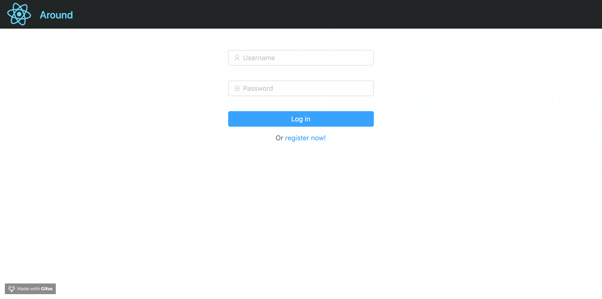
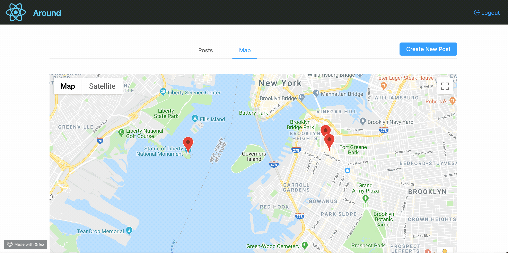

# GeoIndex-based social networking site

Backend APIs of a geoIndex-based social network website project.
- The Go-based website provides "Create Image Post", "Nearby Posts in Map" and "Nearby Posts as Gallery" features.
- Utilized geolocation-based search of ElasticSearch on GCE to display nearby posts on a Google Maps instance.
- Used BigTable and GCS to store post content and images. The website is deployed to GAE for scalability.
  

## Signin

  

## Posts

  

## Map - view posts in map

  

## Zoom - narrow down posts within a region

  

## Create - create a new image post

  

## Finish creating a new post

